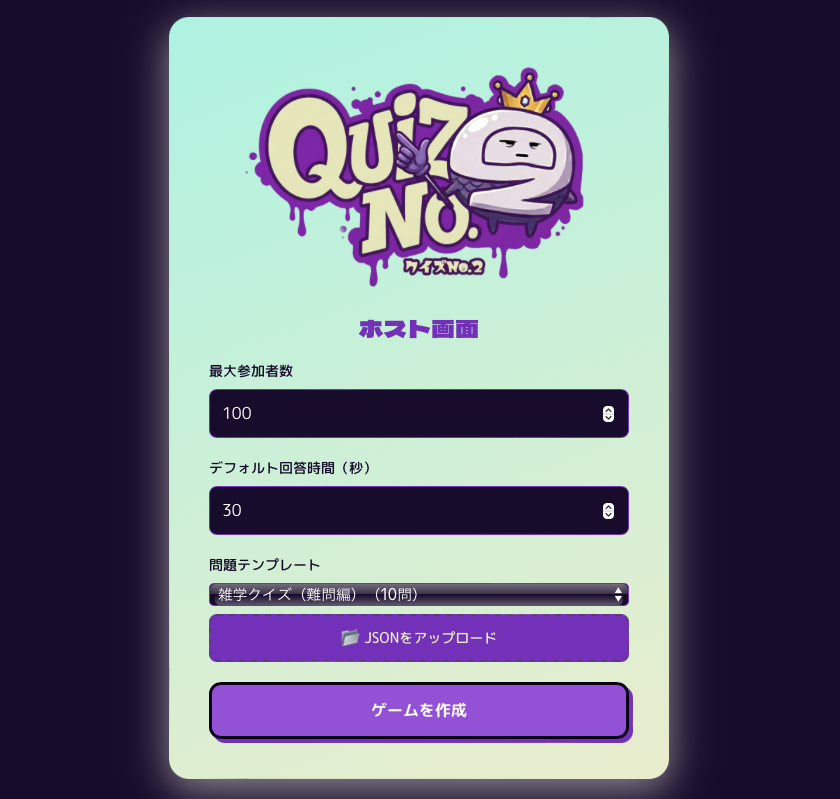
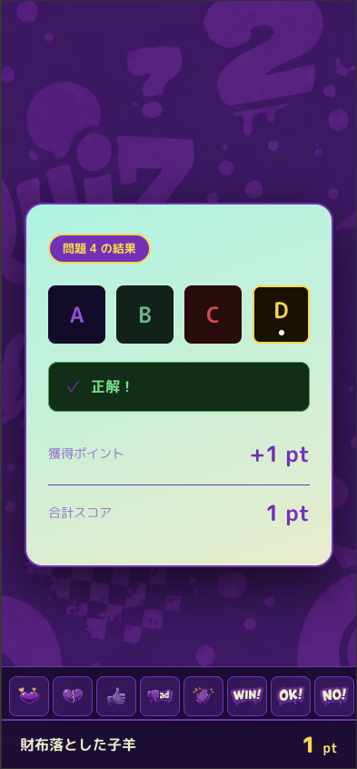
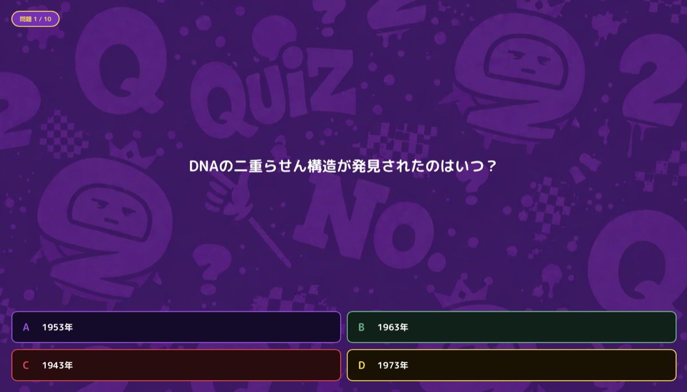

# クイズNo2 - 多人数参加型クイズゲーム

## プロジェクト概要

WebSocketを使用した多人数参加型の4択クイズゲームシステム。
正解ではなく「2番目に多く選ばれた選択肢」を選んだプレイヤーに高得点が付与される、戦略性のあるクイズゲーム。

## 作成動機

以前打ち合わせ用の資料として名前とルールだけ考えたゲーム。
実際に作る機会に恵まれなかったため、本当におもしろいか試したくて作成。

## 特徴

- **リアルタイム通信**: WebSocketによる低レイテンシ通信
- **ユニークな得点システム**: 正解(1pt) < 2位の選択肢(2pt) < 両方(3pt)
- **3画面構成**: ホスト画面、プレイヤー画面、共有画面（プロジェクター投影用）
- **テンプレート機能**: サーバーテンプレート選択 + カスタムJSONアップロード
- **画像対応**: 問題・選択肢に画像URL指定可能（オプション）
- **定員設定**: ホストがルームごとに参加人数の上限を指定可能（デフォルト100）
- **途中経過リーダーボード**: 半分終了時点で1位を伏せた中間ランキングを表示
- **オンデマンド起動**: 常時サーバー稼働不要、使用時のみ起動

## 画面構成

### 1. ホスト画面（Host Control Panel）
- **デバイス**: PC/タブレット
- **役割**: ゲーム全体の進行管理
- **機能**: テンプレート選択、出題進行、参加者管理、結果確認



### 2. プレイヤー画面（Player Interface）
- **デバイス**: スマートフォン
- **役割**: 各プレイヤーの回答デバイス
- **機能**: ルーム参加、問題への回答、スコア確認



### 3. 共有画面（Display Screen）
- **デバイス**: プロジェクター/大型ディスプレイ
- **役割**: 会場全体で共有する大画面
- **機能**: 問題・選択肢の表示、タイマー、結果発表、リーダーボード



詳細は [SCREEN_SPEC.md](docs/SCREEN_SPEC.md) を参照。

## 技術スタック

### フロントエンド
- **React 18** (TypeScript)
- **Vite** (ビルドツール)
- **Socket.io-client** (WebSocket通信)
- **React Router 6** (ルーティング)

### バックエンド
- **Node.js** (TypeScript / tsx)
- **Socket.io 4** (WebSocketサーバー)
- **Express** (HTTPサーバー)

### インフラ
- **フロントエンド**: Vercel / Netlify
- **バックエンド**: Railway / Render
- **データ永続化**: インメモリのみ（外部DBなし）

## プロジェクト構成

```
quize-second/
├── docs/                        # ドキュメント
│   ├── SCORING_RULES.md        # 得点ルール詳細
│   ├── STATE_MANAGEMENT.md     # 状態管理仕様書
│   ├── API_SPEC.md             # WebSocket API仕様
│   ├── SCREEN_SPEC.md          # 画面仕様書
│   ├── QUIZ_TEMPLATE_SPEC.md   # クイズテンプレート仕様書
│   └── TECHNICAL_SPEC.md       # 技術仕様書
├── templates/                   # クイズテンプレート（JSON）※カスタムアップロード用サンプル
│   ├── default.json            # デフォルトクイズ（10問）
│   ├── geography-japan.json    # 日本地理クイズ（15問）
│   └── test.json               # テスト用テンプレート
├── types/                       # 共通型定義（サーバー・クライアント共用）
│   ├── game.ts                 # ゲーム関連の型定義
│   └── events.ts               # WebSocketイベントの型定義
├── server/                      # バックエンド
│   ├── index.ts                # サーバーエントリーポイント
│   ├── managers/               # ビジネスロジック
│   │   ├── RoomManager.ts      # ルーム管理
│   │   ├── PlayerManager.ts    # プレイヤー管理
│   │   ├── GameFlowManager.ts  # ゲームフロー・採点ロジック
│   │   └── TemplateManager.ts  # クイズテンプレート管理
│   ├── socket/
│   │   └── handlers.ts         # Socket.IOイベントハンドラー
│   ├── templates/              # サーバー組み込みテンプレート
│   │   ├── default.json
│   │   ├── geography-japan.json
│   │   └── trivia-hard.json
│   └── utils/
│       └── nameGenerator.ts    # ランダムホスト名生成
├── src/                         # フロントエンド（React + Vite）
│   ├── contexts/
│   │   └── SocketContext.tsx   # WebSocketコンテキスト
│   ├── lib/
│   │   ├── socket.ts           # Socket.ioクライアント
│   │   └── gameUtils.ts        # 状態復元ユーティリティ
│   ├── pages/
│   │   ├── host/               # ホスト画面
│   │   │   ├── HostApp.tsx
│   │   │   └── components/
│   │   │       ├── HostSetup.tsx
│   │   │       ├── HostLobby.tsx
│   │   │       ├── HostReceptionClosed.tsx
│   │   │       ├── HostIntro.tsx
│   │   │       ├── HostQuizPrepare.tsx
│   │   │       ├── HostQuizShowing.tsx
│   │   │       ├── HostQuizActive.tsx
│   │   │       ├── HostQuizClosed.tsx
│   │   │       ├── HostResultVotes.tsx
│   │   │       ├── HostResultPoints.tsx
│   │   │       ├── HostInterimLeaderboard.tsx
│   │   │       ├── HostFinalResult.tsx
│   │   │       └── HostOptionsMenu.tsx
│   │   ├── player/             # プレイヤー画面
│   │   │   ├── PlayerApp.tsx
│   │   │   └── components/
│   │   │       ├── PlayerJoin.tsx
│   │   │       ├── PlayerLobby.tsx
│   │   │       ├── PlayerReceptionClosed.tsx
│   │   │       ├── PlayerIntro.tsx
│   │   │       ├── PlayerQuizActive.tsx
│   │   │       ├── PlayerQuizWaiting.tsx
│   │   │       ├── PlayerResultVotes.tsx
│   │   │       ├── PlayerResultPoints.tsx
│   │   │       ├── PlayerFinalResult.tsx
│   │   │       ├── PlayerGameOver.tsx
│   │   │       └── StampPanel.tsx
│   │   └── display/            # 共有画面（プロジェクター用）
│   │       ├── DisplayApp.tsx
│   │       └── components/
│   │           ├── DisplayLobby.tsx
│   │           ├── DisplayReceptionClosed.tsx
│   │           ├── DisplayIntro.tsx
│   │           ├── DisplayQuizPrepare.tsx
│   │           ├── DisplayQuizShowing.tsx
│   │           ├── DisplayQuizActive.tsx
│   │           ├── DisplayResultVotes.tsx
│   │           ├── DisplayResultPoints.tsx
│   │           ├── DisplayInterimLeaderboard.tsx
│   │           ├── DisplayFinalResult.tsx
│   │           ├── DisplayGameOver.tsx
│   │           └── StampOverlay.tsx
│   ├── styles/
│   │   └── theme.ts            # デザイントークン
│   └── stamps/                 # スタンプ画像
├── scripts/                     # 開発用スクリプト
│   ├── bot-players.ts          # Botプレイヤー自動接続・回答スクリプト
│   └── test-stamp.ts           # スタンプ機能テストスクリプト
├── .env.example                 # 環境変数のサンプル
├── package.json                 # 依存関係・スクリプト（モノリポ）
├── tsconfig.json
└── vite.config.ts
```

## 得点システム

| 状況 | 獲得ポイント |
|------|------------|
| 正解のみ（1位の選択肢） | 1pt |
| 2位の選択肢のみ | 2pt |
| 正解 かつ 2位の選択肢 | 3pt |
| それ以外 | 0pt |

詳細は [SCORING_RULES.md](docs/SCORING_RULES.md) を参照。

## ゲームフロー

```
ロビー（参加者募集）
  ↓ ホスト「ゲーム開始」
受付終了 → イントロ → 問題準備
  ↓ 出題フェーズ（問題文 → 画像 → 選択肢）
  ↓ 回答受付中（タイマー）
  ↓ 回答締切・採点
  ↓ 結果発表フェーズ（正解 → 得票数 → ポイント）
  ↓ 半分終了時 → 途中経過リーダーボード（1位は???表示）
  ↓ 全問終了時 → 最終結果
```

## 開発状況

### ✅ Phase 1: 基本設計・型定義 (完了)
- [x] 型定義の実装 (`types/game.ts`, `types/events.ts`)
- [x] 状態管理仕様書・API仕様書の作成

### ✅ Phase 2: サーバー実装 (完了)
- [x] Socket.io サーバー構築
- [x] ルーム管理（RoomManager）
- [x] プレイヤー管理（PlayerManager）
- [x] ゲームフロー・採点ロジック（GameFlowManager）
- [x] クイズテンプレート管理（TemplateManager）
- [x] 全WebSocketイベントハンドラー
- [x] 再接続・状態同期機能
- [x] 途中経過リーダーボード機能

### ✅ Phase 3: UI/UX実装 (完了)
- [x] React + Vite クライアント構築
- [x] ホスト画面（コントロールパネル）
- [x] プレイヤー画面（モバイル最適化）
- [x] 共有画面（プロジェクター用、大画面UI）
- [x] リアルタイム結果表示
- [x] 途中経過リーダーボード画面（共有画面・ホスト両対応）

### ⏳ Phase 4: テスト・デプロイ (進行中)
- [x] WebSocket接続テスト
- [x] Botプレイヤーによるフルゲームフロー動作確認
- [ ] 負荷テスト（100名同時接続）
- [ ] デプロイ設定

## セットアップ

### 必要要件
- Node.js 18.x 以上

### インストール

```bash
npm install
```

### 開発環境での起動

```bash
# サーバーとクライアントを同時起動
npm run dev

# 個別起動
npm run dev:server   # サーバーのみ
npm run dev:client   # クライアントのみ
```

### ビルド

```bash
npm run build
```

### 本番起動

```bash
npm start
```

### 型チェック

```bash
npm run type-check
```

### 環境変数

`.env.example` をコピーして `.env.local` を作成し、必要に応じて編集してください。

```bash
cp .env.example .env.local
```

## ライセンス

MIT
